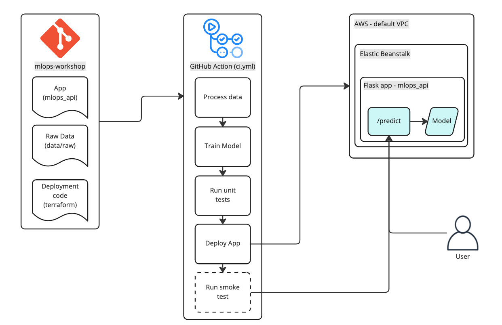

# ML Ops Intro

A simple Machine Learning Operations (ML Ops) demo with all aspects in a single repo. The focus is on showing the processes involved for data, model and a consuming application, and how to bring it all together with a cloud deployment.

The subject of the repo is a web app which predicts the number of vehicle charge points in the US. The rough process for this demo is:
- data begins as an excel spreadsheet in the notebooks folder
- data is explored via a notebook
- data gets processed to produce a CSV file
- a training script is used to generate a model
- model is deployed

## Getting Started

These instructions will help you get up and running on your local machine. Deployment instructions are provided further down.

### Prerequisites

The first thing to do is fork the repo so that you can make edits to it and push them.

To be able to build, test, and deploy you will need:
- Python 3.9
- Poetry

For development, you will need some extra tools:
- Terraform
- Terragrunt
- Python IDE (ideally VS Code as I haven't tried pyCharm)
- Docker
- DVC
- AWS credentials

### AWS Credentials

To be able to interact with AWS for the remote data/model storage and deployment via Terraform, you will need to have valid AWS credentials in your `.aws/credentials`. The easiest way to do this is to use `aws-ak-training` on the command line. If you don't already have it set up, there is a Guru card about this entitled "AK AWS-Google Federation".

### Installation

To install the dependencies type:

`poetry install`

### Unit tests

To run the unit tests type `make unit-tests`.

Note: tests will fail if you don't have a processed data file and a model file in the data folder.

### Data exploration

The repo includes some Jupyter notebooks that explore the sample data and train an initial model. They can be found in the notebooks folder.

Data exploration is, in this repo, a manual process so you will need to run through the notebook.

## Exercises

There are exercises to work through in the exercises folder. Make sure you've forked the repo!